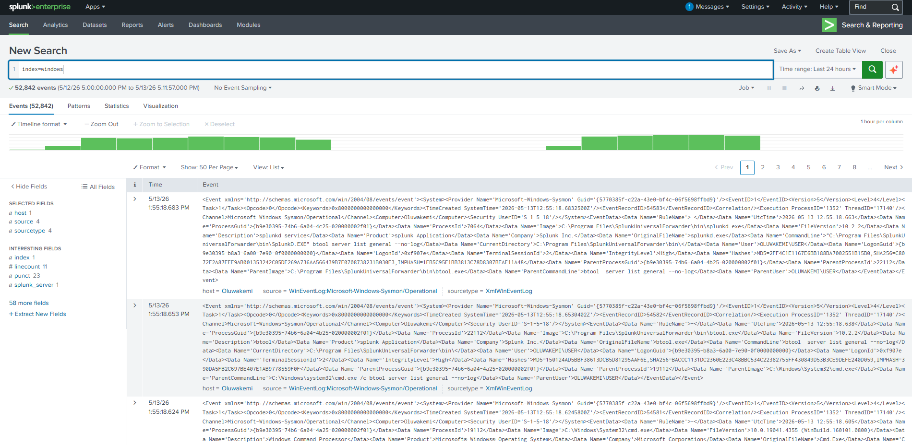
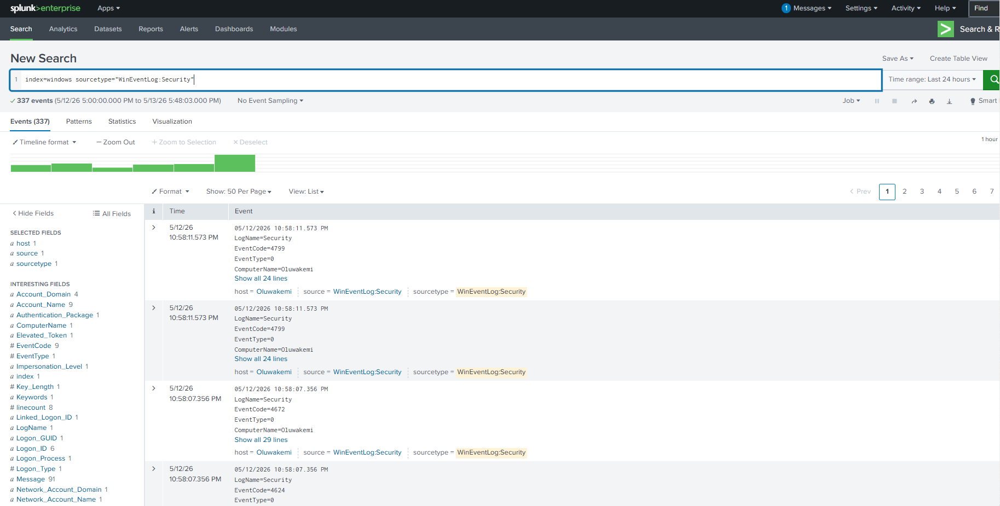
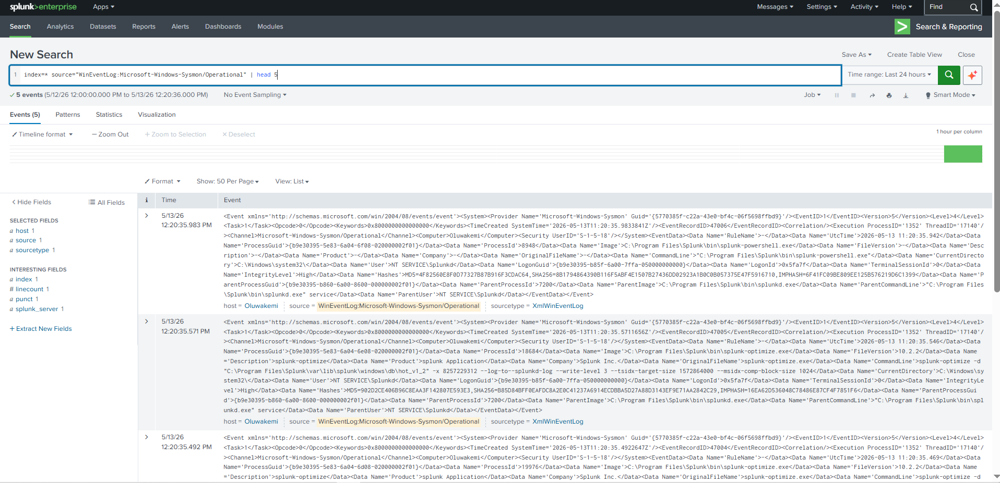
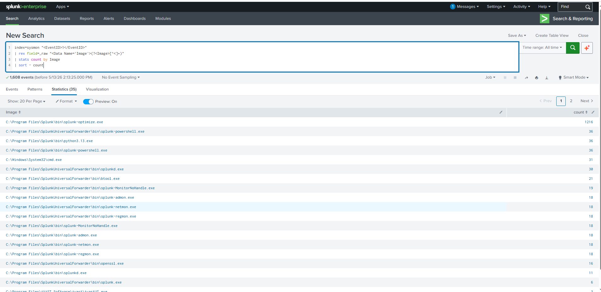
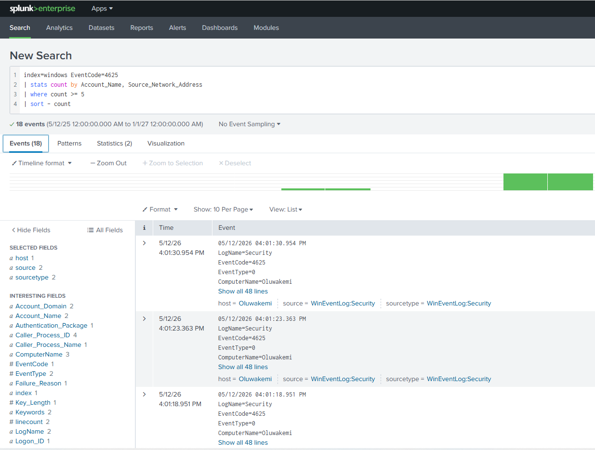

# Home SIEM Lab with Splunk

## Project Overview
This project demonstrates how I built a home SIEM lab using Splunk Free, Sysmon, and Windows Event Logs to detect suspicious activities such as failed logins, brute-force attempts, suspicious PowerShell usage, and process execution.

## Lab Architecture
Windows Endpoint → Splunk Universal Forwarder → Splunk Enterprise → Searches, Alerts, and Dashboards

## SIEM Lab Screenshots

### 1. Splunk Search & Reporting Homepage


### 2. Windows Security Logs in Splunk


### 3. Sysmon Logs in Splunk


### 4. Failed Login Detection - Event ID 4625


### 5. Brute Force Detection Search


### 6. Suspicious PowerShell Detection


### 7. Sysmon Process Creation Events


### 8. Network Connection Monitoring


### 9. SOC Dashboard Overview


## Dashboard Configuration

The Splunk dashboard configuration used in this lab can be found here:

[View SOC Monitoring Dashboard XML](dashboards/soc-monitoring-dashboard.xml)

This dashboard contains panels for:
- Failed login detection
- Suspicious PowerShell activity
- Sysmon process monitoring
- Network connection analysis
- Brute-force detection

### 10. Alert or Report Configuration


## Tools Used
- Splunk Free
- Splunk Universal Forwarder
- Sysmon
- Windows Event Viewer
- PowerShell

## Detection Use Cases
- Failed login detection
- Brute-force login attempts
- Suspicious PowerShell activity
- Sysmon process creation monitoring
- Network connection monitoring

## Splunk Detection Searches

### Failed Login Detection

File:

`splunk-searches/failed-logins.spl`

```spl
index=windows sourcetype="WinEventLog:Security" EventCode=4625
| stats count by Account_Name, Source_Network_Address, Failure_Reason
| sort - count
```

---

### Brute Force Detection

File:

`splunk-searches/brute-force-detection.spl`

```spl
index=windows sourcetype="WinEventLog:Security" EventCode=4625
| stats count by Account_Name, Source_Network_Address
| where count >= 5
| sort - count
```

---

### Suspicious PowerShell Detection

File:

`splunk-searches/suspicious-powershell.spl`

```spl
index=windows sourcetype="XmlWinEventLog:Microsoft-Windows-Sysmon/Operational"
(Image="*powershell.exe*" OR CommandLine="*EncodedCommand*" OR CommandLine="*-enc*")
| table _time host User Image CommandLine ParentImage
```

---

### Sysmon Process Creation Monitoring

File:

`splunk-searches/sysmon-process-creation.spl`

```spl
index=windows sourcetype="XmlWinEventLog:Microsoft-Windows-Sysmon/Operational" EventCode=1
| table _time host User Image CommandLine ParentImage
```

---

### Network Connection Monitoring

File:

`splunk-searches/network-connections.spl`

```spl
index=windows sourcetype="XmlWinEventLog:Microsoft-Windows-Sysmon/Operational" EventCode=3
| table _time host Image DestinationIp DestinationPort Protocol
```

## Configuration Files

### inputs.conf

Used to ingest Windows Event Logs and Sysmon logs into Splunk.

Location:

```text
configs/inputs.conf
```

### outputs.conf

Used by the Splunk Universal Forwarder to send logs to the Splunk server.

Location:

```text
configs/outputs.conf
```

### sysmonconfig.xml

Sysmon configuration used to collect endpoint telemetry.

Location:

```text
configs/sysmonconfig.xml
```

### sysmon-notes.md

Documentation of Sysmon event IDs and installation steps.

Location:

```text
configs/sysmon-notes.md
```

## Incident Investigation Example
Explain one alert from detection to investigation.

## What I Learned
- Log collection
- SIEM monitoring
- Windows event analysis
- Sysmon telemetry
- SOC investigation workflow
- Dashboard and alert creation

## Conclusion
This lab strengthened my practical SOC Analyst skills by simulating real-world log monitoring and security investigation workflows.
